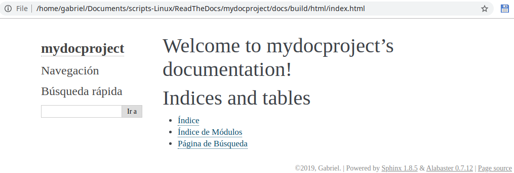

==================================
Generando documentación con Sphinx
==================================

`Sphinx`_ será la herramienta usada para la creación de documentación. Otra alternativa compatible con `Read The Docs`_ es `MkDocs`_.

.. _Sphinx: http://www.sphinx-doc.org/en/master/
.. _MkDocs: https://www.mkdocs.org/
.. _Read The Docs: https://readthedocs.org/

1. Dentro del repositorio clonado, crear un directorio llamado ``docs`` donde se encontrará toda nuestra documentación y movernos a ese directorio:

.. code-block:: bash

    mkdir docs
    cd docs

2. Inicializar el directorio ``docs`` como directorio de documentación de Sphinx:

.. code-block:: bash

    sphinx-quickstart

.. Note::
    Equivalentemente al anterior y a este paso podemos usar un solo comando los comprende: ``sphinx-quickstart docs``

Aparecerá un wizard con mútiples opciones de Sphinx:

::

    Welcome to the Sphinx 1.8.5 quickstart utility.

    Please enter values for the following settings (just press Enter to
    accept a default value, if one is given in brackets).

    Selected root path: .

    You have two options for placing the build directory for Sphinx output.
    Either, you use a directory "_build" within the root path, or you separate
    "source" and "build" directories within the root path.
    > Separate source and build directories (y/n) [n]: y

    Inside the root directory, two more directories will be created; "_templates"
    for custom HTML templates and "_static" for custom stylesheets and other static
    files. You can enter another prefix (such as ".") to replace the underscore.
    > Name prefix for templates and static dir [_]:

    The project name will occur in several places in the built documentation.
    > Project name: mydocproject
    > Author name(s): Gabriel
    > Project release []: 

    If the documents are to be written in a language other than English,
    you can select a language here by its language code. Sphinx will then
    translate text that it generates into that language.

    For a list of supported codes, see
    http://sphinx-doc.org/config.html#confval-language.
    > Project language [en]: es

    The file name suffix for source files. Commonly, this is either ".txt"
    or ".rst".  Only files with this suffix are considered documents.
    > Source file suffix [.rst]: 

    One document is special in that it is considered the top node of the
    "contents tree", that is, it is the root of the hierarchical structure
    of the documents. Normally, this is "index", but if your "index"
    document is a custom template, you can also set this to another filename.
    > Name of your master document (without suffix) [index]: 
    Indicate which of the following Sphinx extensions should be enabled:
    > autodoc: automatically insert docstrings from modules (y/n) [n]: 
    > doctest: automatically test code snippets in doctest blocks (y/n) [n]: 
    > intersphinx: link between Sphinx documentation of different projects (y/n) [n]: 
    > todo: write "todo" entries that can be shown or hidden on build (y/n) [n]: 
    > coverage: checks for documentation coverage (y/n) [n]: 
    > imgmath: include math, rendered as PNG or SVG images (y/n) [n]: 
    > mathjax: include math, rendered in the browser by MathJax (y/n) [n]: 
    > ifconfig: conditional inclusion of content based on config values (y/n) [n]: 
    > viewcode: include links to the source code of documented Python objects (y/n) [n]: 
    > githubpages: create .nojekyll file to publish the document on GitHub pages (y/n) [n]: 

    A Makefile and a Windows command file can be generated for you so that you
    only have to run e.g. `make html` instead of invoking sphinx-build
    directly.
    > Create Makefile? (y/n) [y]: 
    > Create Windows command file? (y/n) [y]: 

    Creating file ./source/conf.py.
    Creating file ./source/index.rst.
    Creating file ./Makefile.
    Creating file ./make.bat.

    Finished: An initial directory structure has been created.

    You should now populate your master file ./source/index.rst and create other documentation
    source files. Use the Makefile to build the docs, like so:
    make builder
    where "builder" is one of the supported builders, e.g. html, latex or linkcheck.

.. Important::
    Se generará un archivo ``docs/source/conf.py`` con la configuración aplicada en el wizard.

3. Desde el directorio ``docs/`` crearemos los archivos html:

.. code-block:: bash

    make html

::

    Running Sphinx v1.8.5
    loading translations [es]... done
    making output directory...
    building [mo]: targets for 0 po files that are out of date
    building [html]: targets for 1 source files that are out of date
    updating environment: 1 added, 0 changed, 0 removed
    reading sources... [100%] index                                                                         
    looking for now-outdated files... none found
    pickling environment... done
    checking consistency... done
    preparing documents... done
    writing output... [100%] index                                                                          
    generating indices... genindex
    writing additional pages... search
    copying static files... done
    copying extra files... done
    dumping search index in Spanish (code: es) ... done
    dumping object inventory... done
    build succeeded.

    The HTML pages are in build/html.

4. Abrir el archivo ``docs/build/index.html`` para comprobar que se haya generado la documentación correctamente:

.. code-block:: bash

    firefox build/html/index.html

   Página index.html inicial con el tema Alabaster

.. Important::
    - Todos los archivos ``.rst`` generados bajo el directorio ``docs/source`` tendrán su correspondiente archivo ``.html`` bajo el directorio ``docs/build``.
    - Los archivos ``.rst`` serán llamados desde el archivo ``index.rst`` usando elementos ``toctree``, indicando la ruta y el nombre del archivo.

