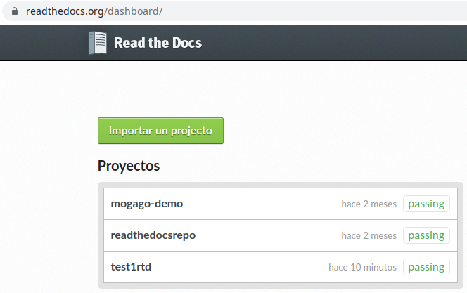
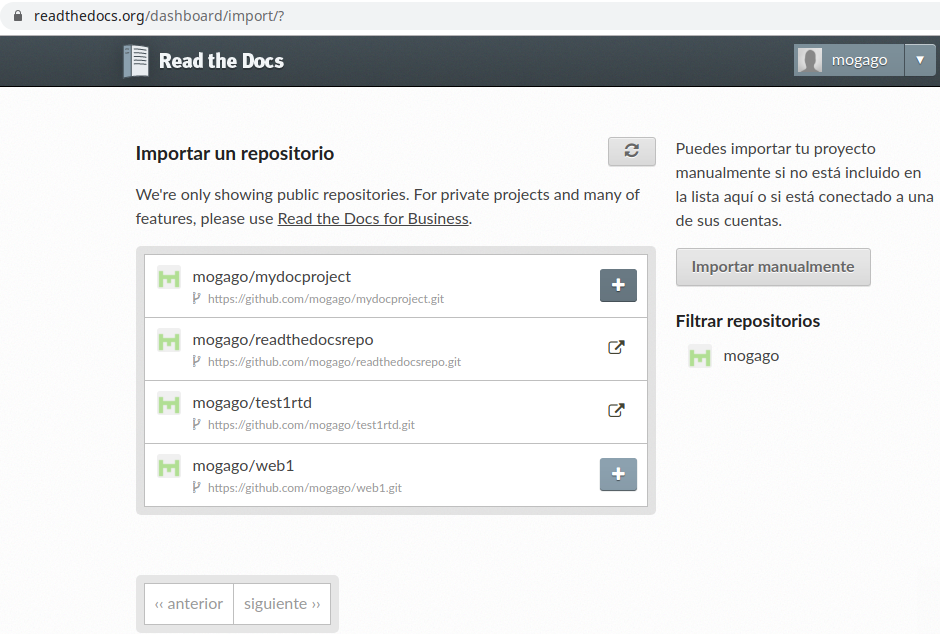
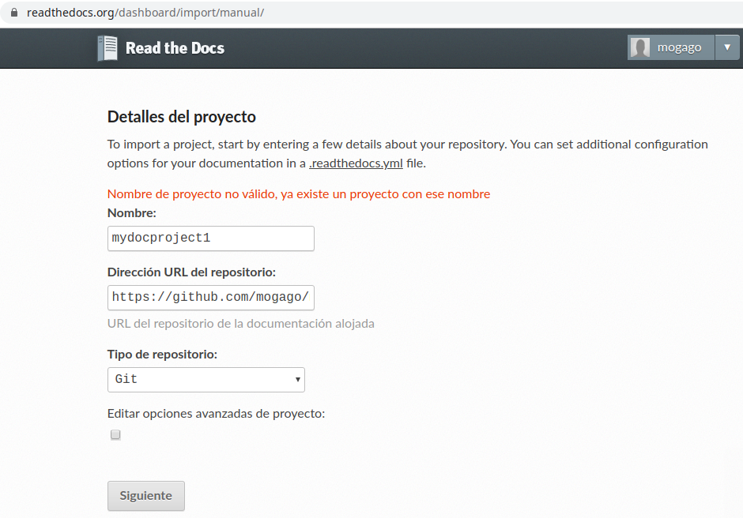
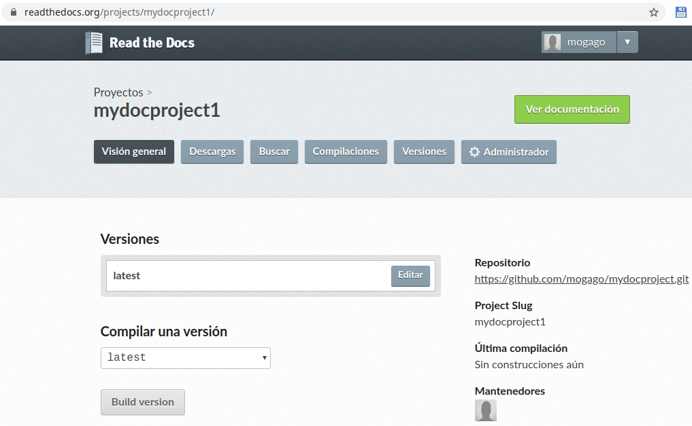
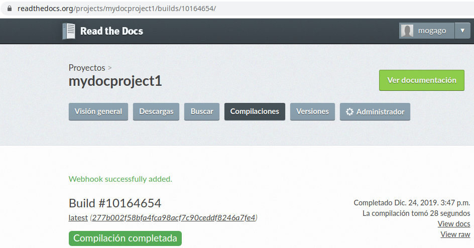
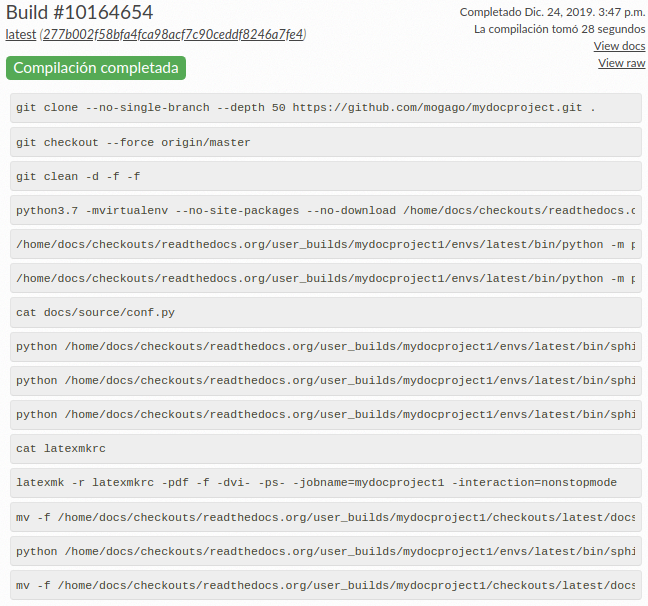
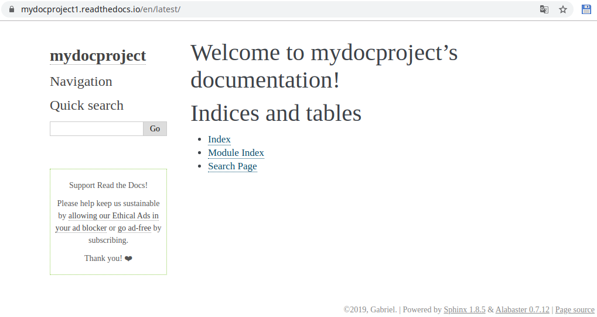
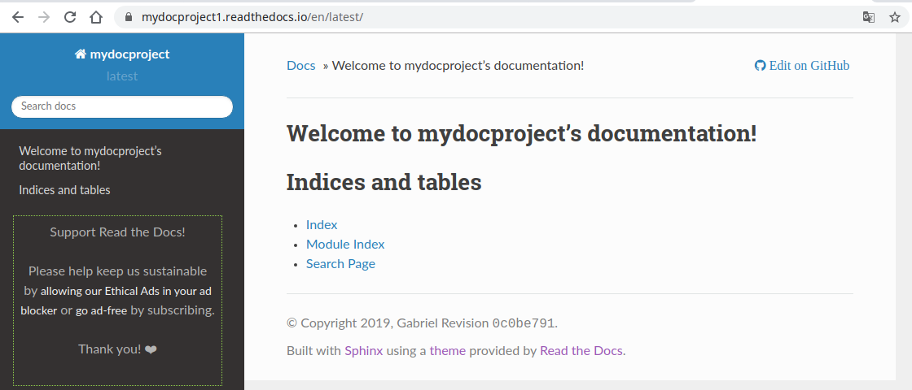

===============================
Publicando documentación en RTD 
===============================

`Read the Docs`_ simplifica la documentación de software, mediante la automatización del building, versionamiento y `hosting de nuestros docs`_.

.. _Read The Docs: https://readthedocs.org/
.. _hosting de nuestros docs: https://docs.readthedocs.io/en/stable/

1. Primero debemos subir la documentación generada con Sphinx a nuestro repositorio en Github. Ejecutar los comandos desde la carpeta raíz del repositorio:

.. code-block:: bash

    git add .
    git commit -m "Primer commit para creacion de Documentacion"
    git push

2. Entrar a `nuestro dashboard de la página de RTD`_ , y teniendo nuestra cuenta de Github asociada, importaremos el proyecto haciendo clic en :guilabel:`Importar un proyecto`:

.. _nuestro dashboard de la página de RTD: https://readthedocs.org/dashboard/

   Dashboard de RTD - Botón :guilabel:`Importar un proyecto`

En la siguiente pantalla, actualizar la lista de repositorios con el botón de un símbolo de :guilabel:`Actualizar`. Seleccionar el repositorio de Github que vamos a importar haciendo clic en el botón :guilabel:`+`:

   Dashboard de RTD - Importar un repositorio

Luego revisar la opciones del proyecto como el nombre que tendrá la URL y clic en :guilabel:`Siguiente`:

   Dashboard de RTD - Opciones para importar

3. Para hacer un build del repositorio desde RTD, clic en :guilabel:`Build version`:

   Dashboard de RTD - Build de repositorio

   Dashboard de RTD - Compilación completada

   Dashboard de RTD - Log de compilación

4. Ahora nuestra documentación se encuentra pública, estando hosteada por RTD bajo el dominio readthedocs.io. Podremos verla haciendo clic en el botón :guilabel:`Ver documentación` de la anterior pantalla:

Página web de ejemplo: https://mydocproject1.readthedocs.io/en/latest/

   Página de documentación hosteada bajo el dominio readthedocs.io

5. Para cambiar el tema de la página web actual (Alabaster) al que usa RTD por defecto editar el archivo ``docs/source/conf.py`` comentando la línea de ``html_theme = 'alabaster'``:

.. code-block:: python
   :linenos:
   :emphasize-lines: 6

    # -- Options for HTML output -------------------------------------------------

    # The theme to use for HTML and HTML Help pages.  See the documentation for
    # a list of builtin themes.
    #
    #html_theme = 'alabaster'

.. Warning::
    El cambio de tema solo se está aplicando para la página pública, el tema no se aplica a los archivos locales.

Luego actualizar el repositorio de Github:

.. code-block:: bash

    git add .
    git commit -m "Deshabilitando tema por defecto de Sphinx"
    git push

La página pública de la documentación ahora tendrá el tema de Read the Docs:

   Tema de Read the Docs en página pública
